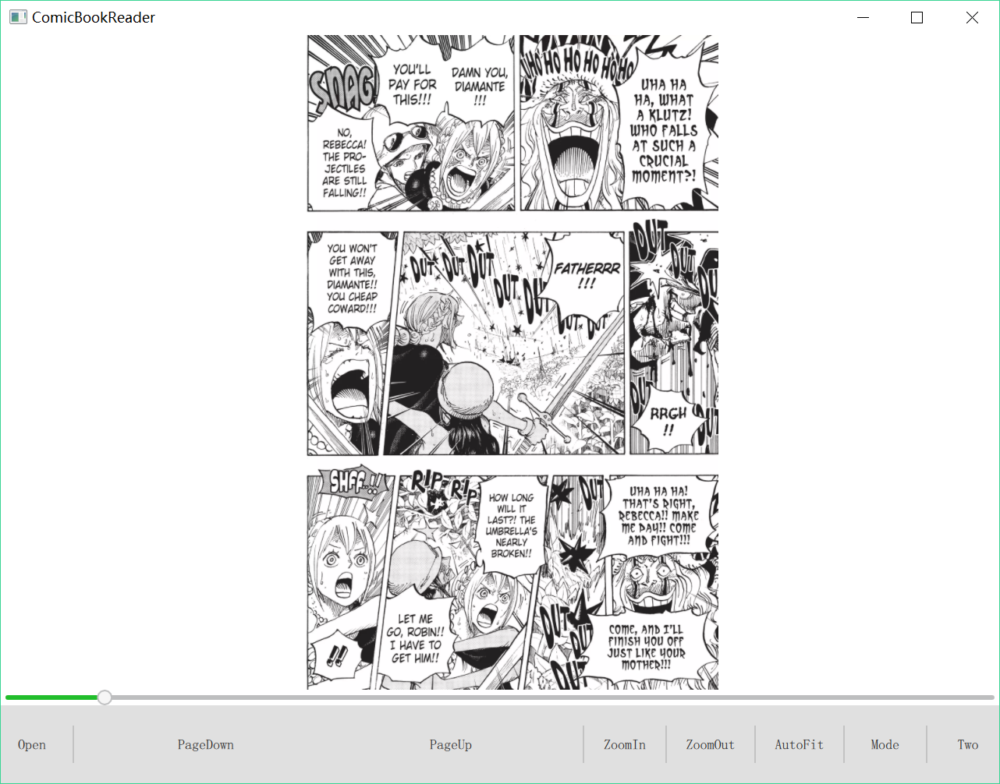
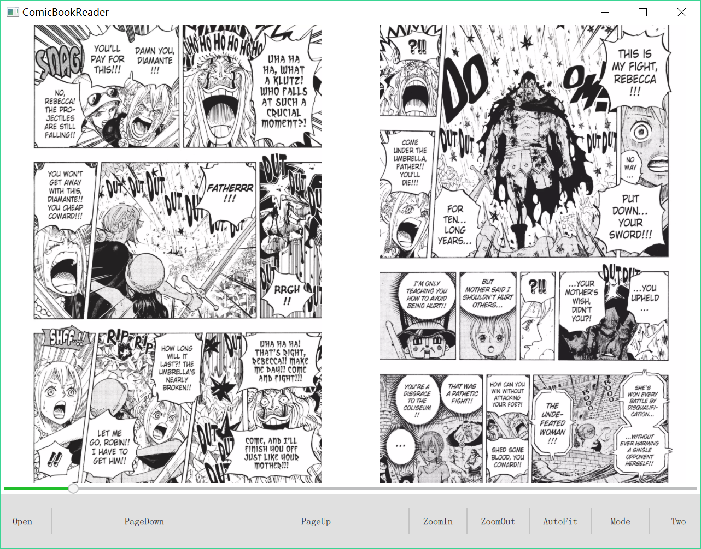

# Report

### Introduction

ComicBookReader is a c++ program to read .cbr or .cbz comic book files. It uses the qml technology of Qt to create the GUI,  *OpenCV*  library to process the images, and the *unarrlib* to extract specific files from cbr/cbz file to memory. 

### UML

### Features

- **Asynchronous**

  The GUI part and the other parts are asynchronous. The entire program will not be blocked even the reading or processing is not finished. 

  ​

- **Fast**

  To accelerate the entire program, lots of related work are done.

  - **Only reading the requested.**

    *zlib* can read specific files directly from *.zip*, but not *.rar*.  *libarchive* can read files from *.zip* and *.rar*, but need to read successively (cannot read the files behind directly).

    To solve this problem, the developer of *sumatrapdf* create a new library called *unarrlib*, which can read specific files directly from the *.zip* or *.rar*, no need to read all of the files to memory.

    In our program, it will scan and store the *entry* for every files of the *.zip* or *.rar* in the initialization. Then using these *entry*, it can directly access to the files requested, and read it into the memory.

  - **Avoiding massive IO operation.**

    - Using *unarrlib* to read only the images needed to a buffer.
    - Using OpenCV to read the images directly from the buffer (using function `cv::imdecode()`)

  - **Avoiding massive copy operation.**

    Using the pointer to transform the OpenCV's `mat` type to QT's `qimage` type. Only  a new header of `qimage` is needed to create, the main data of `mat` is used directly by `qimage`, avoiding the massive data copy operation.

  - **Using Cache**

    Almost all of the requested images are cached, Using the `Qcache` structure offered by Qt. This cache is protected by a `ReadWriteLock` which is also provided by Qt. This cache only reserves the pointers of the images, and its size is fixed to 100(maximum 100 images). It automatically free the oldest pointer when it is full. 

  - **parallel Pre-load **

    The processing part and reading part contain 2 thread. One always work for the current page, which has a high priority. Another one always work for the preload, which has a low priority.

    When user requires a specific page `n` from the GUI, the `ImageProcessing` part receives the signal and starts to working, requests the raw image from `ArchieveReader` , finishes the processing, store it into the cache, and send to the GUI. After that, the preload worker starts to work. It preloads the images from `n-15` to `n+20` page, writes the processed image into cache.

    If user changed the current page when the preload worker is working, the worker will automatically stop and give the resource to main processing thread, which will offer the requested image as quick as it can.

  - **Using `std::thread` instead of `qthread`**

    To manage the parallel pre-load thread, the *std::thread* is used, which is much more complicated than *qthread*, but has a much better performance. (A event between signal and slot of *qthread* can has a latency about 10ms.)

- **Different modes for image processing**

  The program supports 3 modes for image processing:

   -  **Raw mode**

      The picture is loaded and directly showed without processing

  - **Text mode**

    The picture is transformed to binary image, in order to highlighting the text, which is  useful for showing document.

    

  - **Image mode**

    The picture is processed by a Gaussian filtered to decrease the noise and by a  Laplace filter to increasing local contrast. This mode is helpful for showing the color photos.

- **One or two image show mode**

  Two showing mode are support:

  - **show one picture once**

    

    ​

  - **show two picture once**

    

- **Free drag and zoom support**

  - The pictures can be dragged freely in the program.
  - By using `ctrl + scrollWheel`, the pictures can be zoomed freely. The zoom center is always located in the point of mouse. 
  - Pressing the `AutoFit` button can reset the size and position of pictures to default.